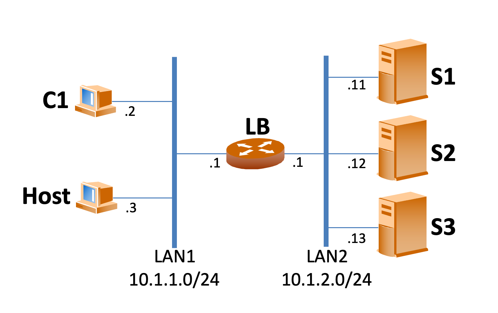

# Creador de entorno virtual con Python

## Descripción del proyecto
Este programa crea un escenario virtualizado de una red corporativa como la que se muestra a continuación:



Mediante el uso del script principal desde la terminal en sistemas linux basados en Debian se pueda automatizar la creación del escenario.

Se crean de 2 a 5 servidores web apache, y se configura un balanceador de carga en el router central "lb" con Haproxy usando round robin simple. El puerto para verificar las estadósticas del load balancer es el 8001 (10.1.1.1:8001).

Las IPv4 de los servidores comienzan en 10.1.2.11 en adelante.

Se añade de manera dinámica y temporal la interfaz LAN1 en el equipo local para poder interactual con el escenario directamente, ya sea usando ping, curl o accediendo al router 10.1.1.1 y sus estadísticas.

## Estructura del proyecto

```
main/
│
├── manage-p2.py           # Archivo principal para ejecutar el programa.
├── config/                # Archivos de configuración.
│   └── manage-p2.json     # Configuración específica en JSON.
│
├── src/                   # Código fuente del proyecto.
│   ├── classes/           # Clases principales.
│   │   └── vm.py          # Definición clase VM.
│   │   └── net.py         # Definición clase NET.
│   ├── utils/             # Funciones de utilidad.
│      ├── utils.py        # Funciones de utilidad general.
│
├── requirements.txt       # Dependencias del proyecto.
├── README.md              # Documentación del proyecto.
└── .gitignore             # Archivos a ignorar por Git.
```

Se tienen dos clases/objetos principales, uno llamado NET que contiene la información asociada a la red, tal como los dispositivos a crear, los archivos base sobre los que crear el escenario, y un mapeo de dispositivo a bridge. Y el otro objeto es VM que contiene todo lo relaciona a cada una de las VMs creadas, como su nombre y sus interfaces.

Cada clase tiene métodos especificados y comentados detalladamente en los mismos scripts.

Principalmente en NET se tienen métodos para la creación de archivos y modificación de los mismos. Mientras que en VM hay métodos para modificar y configurar ficheros dentro de cada VM y métodos para arrancar, detener, destruir, mostrar consolas, cerrar consolas, y otros.

Las clases NET y VM están en el directorio src/classes:
- [net.py](/src/classes/network.py)
- [vm.py](/src/classes/vm.py)

Por otro lado, en src/utils hay un script [utils.py](/src/utils/utils.py) con funciones de utilidad general, como el creador de loggers y una función para crear el diccionario principal que describe a cada dispositivo y sus interfaces.

## Modo de uso

El archivo principal de configuración es un JSON encontrado en el subdirectorio config [Ver aquí](config/manage-p2.json).

En él se deben configurar los nombres de los archivos base (plantillas de imagenes y xml), el número de servidores a crear y el modo del debug (true o false para ver en la misma terminal más o menos detalles del log).

-----------------------

Para usar el programa, se debe ejecutar directamente desde la terminal de la siguiente manera:

```
python3 manage-p2.py {acción} {parámetro (opcional)}
```

Las acciones son 4:
- **create**: crea todos las imágenes qcow2 a partir de la imagen base, crea los archivos "xml" y los modifica según sea necesario, crea los bridges LAN1 y LAN2 con "openvswitch-switch", y modifica los archivos dentro de cada VM según sea necesario.
- **start**: Arranca todas las VM creadas con la acción *create* y además lanza en nuevas ventanas de la terminal "xterm" cada una de las terminales de las VMs.
    - vm_name (opcional): se puede indicar el nombre de la VM específica que se quiera arrancar en lugar de hacerlo con todas.
- **stop**: Detiene/apaga todas las VM iniciadas actualmente y además cierra las ventanas de la terminal "xterm" abiertas para cada una de las terminales de las VMs.
    - vm_name (opcional): se puede indicar el nombre de la VM específica que se quiera detener en lugar de hacerlo con todas.
- **destroy**: Elimina todas las VMs creadas, y también elimina todos los ficheros creados con la acción *create*.

## Requisitos

### Para Linux basado en Debian:
Primero, instalar lo relacionado a la creación de imagenes por diferencias (QEMU), lo relacionado a la creación de switches virtuales, y lo relacionado a la virtualización en si. 
```
sudo apt install qemu-utils qemu-kvm
sudo apt install openvswitch-switch
sudo apt install libvirt-daemon-system libvirt-clients
sudo apt install libguestfs-tools
```
#### Opcionales:
Para ver visualmente si las vm se crean o no (definen):
```
sudo apt install virt-manager
```
Para hacer ifconfig desde ubuntu 24:
```
sudo apt install net-tools
```

#### Extra: solución de problemas comunes

Para poder iniciar alguna vm con virsh start, de debe modificar el archivo /etc/libvirt/qemu.conf, modificando: 
```
user = "{usuario de linux}"
group = "libvirt" # siempre y cuando el usuario sea parte del grupo libvirt, si no agregarlo
```
ver: https://ostechnix.com/solved-cannot-access-storage-file-permission-denied-error-in-kvm-libvirt/


### Python

Librerías Python:
Dentro del entorno virtual creado para correr este programa, usar el archivo requirements.txt con 
```
pip install -r requirements.txt
```

## Nota
El archivo de imagen qcow2 base se puede descargar en https://drive.google.com/file/d/16Zf4A26cHvdu8ArhaFZxTfETVHcr_fre/view?usp=drive_link

Los scripts fueron creados en un entorno local, con una instalación limpia de Ubuntu 24.01 LTS.

Creado por Martín Burgos.